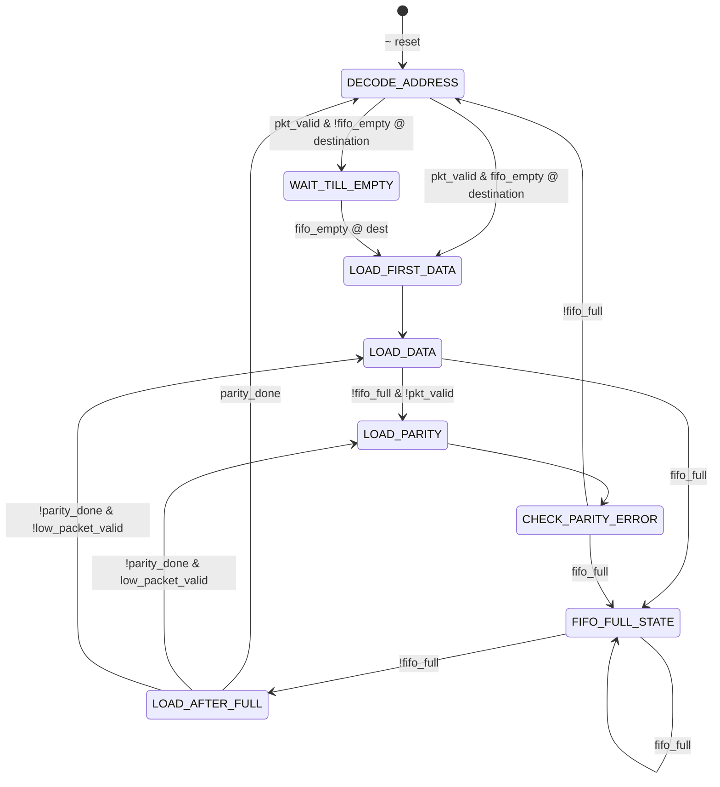

# Controller

🏠[Home](README.md)

This module generates all the control signals when a new packet arrives. Controller consider the whole operation into 8 state.

- `Decode address`
- `Load first data`
- `Load data`
- `Load parity`
- `Check parity error`
- `Fifo full state`
- `Load after full`
- `Wait till empty`

## Interface

| Port       | Direction | Width | From/To           | Function                                         |
| ---------- | --------- | ----- | ----------------- | ------------------------------------------------ |
| clock      | input     | 1     | External          | Synchronize the operations at positive edge      |
| resetn     | input     | 1     | External          | Active low reset given from source               |
| pkt_valid | input | 1  | External | Indicated the data in is valid |
| parity_done | input | 1  | External  | Indicate the parity calculation completed |
| data_in | input | 2 | External | First 2 bits of input packet |
| soft_reset_0 | input | 1  | Synchronizer | Internal signal to reset FIFO 0 |
| soft_reset_1 | input | 1  | Synchronizer  | Internal signal to reset FIFO 1 |
| soft_reset_2 | input | 1  | Synchronizer  | Internal signal to reset FIFO 2 |
| fifo_full | input | 1  | Synchronizer | Indicate the FIFO at current desstination is full |
| low_packet_valid | input | 1  | Register | Show the register status `packet valid` |
| fifo_empty_0 | input | 1  | FIFO 0 | Indicate FIFO 0 is empty (new header packet will assgin only if empty) |
| fifo_empty_1 | input | 1  | FIFO 1 | ndicate FIFO 1 is empty (new header packet will assgin only if empty). |
| fifo_empty_2 | input | 1  | FIFO 2 | ndicate FIFO 2 is empty (new header packet will assgin only if empty). |
| busy | output | 1  | External | Stop the user from inputing data. |
| detect_add | output | 1  | Register, Sync. | Indicate system is in the state to detect address. |
| ld_state | output  | 1  | Register | Indicate system is in the state of loading payload. |
| laf_state | output  | 1  | Register | High when destination fifo get write space after begin full. |
| full_state | output  | 1  | Register | Indicate the system is in wait state due to fifo full. |
| write_enb_reg | output  | 1  | Synchronizer | Used to set synchronizer state. |
| rst_int_reg | output  | 1  | Register | Used to set register state. |
| lfd_state | output  | 1 | FIFO, Register | Indicate the system is in state of loading header. |

## State Diagram

🏠[Home](README.md)