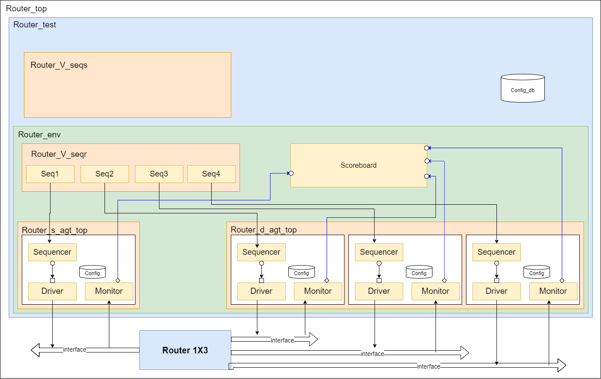

# Verification Plan

**Objectives**

The primary goals of the verification plan are:

1. Verify the functional correctness of the router.
2. Ensure robustness by testing edge cases and error scenarios.
3. Achieve 100% functional and code coverage.

## Testbench Architecture

## Detailed Breakdown of Each Component

- [Interface]()